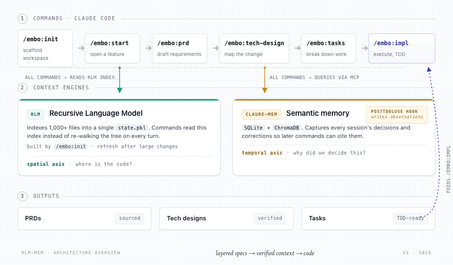
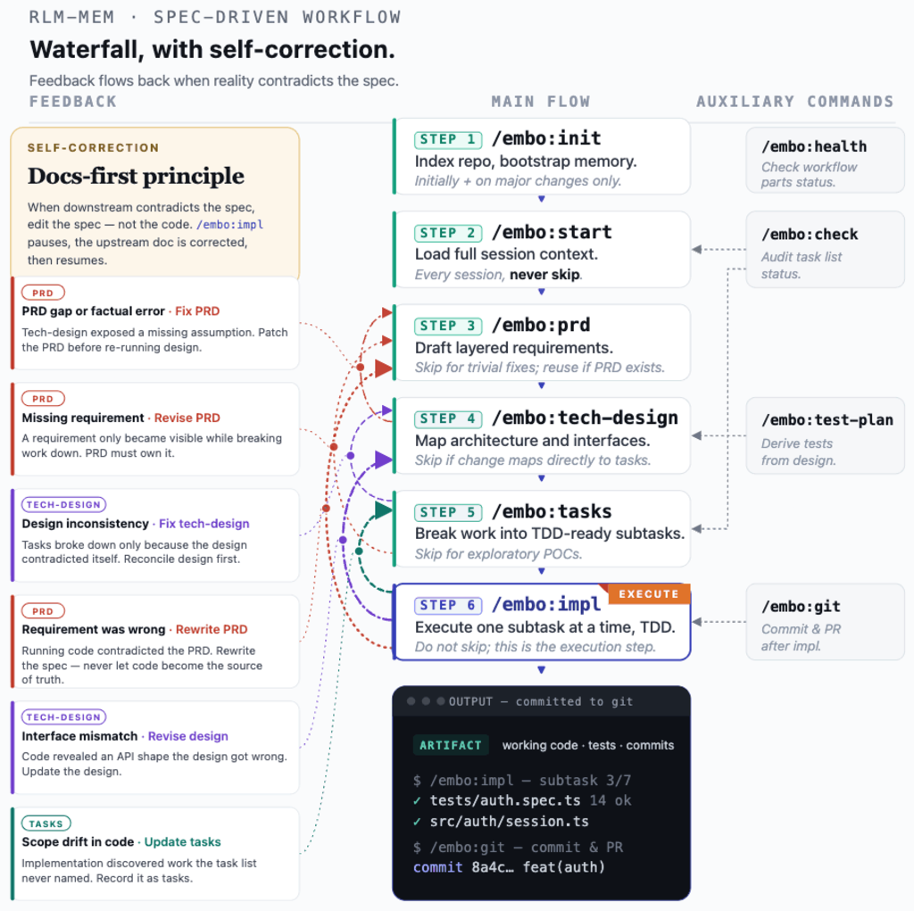

# embo

**A spec-driven Claude Code workflow** —
**`/embo:prd` → `/embo:tech-design` → `/embo:tasks` → `/embo:impl`**,
backed by a persistent codebase index (RLM) and cross-session memory
(claude-mem).

> **TL;DR**
> - **Category:** spec-driven development workflow for Claude Code
> - **Differentiator:** the only framework with **both** persistent
> codebase indexing **and** cross-session memory
> - **Install:** **two plugins, inside Claude Code** — (1)
> `/plugin install embo@embo`, (2) install the **claude-mem** plugin.
> See [Install](#install) below.
> - **First session:** `/embo:init` -> `/embo:start` -> `/embo:prd`
> - **Compare to alternatives:** [Comparison](#comparison)
> - **Why this exists:** [Why](#why-this-exists) |
> full evidence: [docs/WHY.md](docs/WHY.md)

<!-- ARCHITECTURE-DIAGRAM-ANCHOR -->


<sub>Source prompt: [`assets/diagrams/architecture-overview.prompt.md`](assets/diagrams/architecture-overview.prompt.md) — regenerate via Claude Design.</sub>



<sub>Source prompt: [`assets/diagrams/workflow-sequence.prompt.md`](assets/diagrams/workflow-sequence.prompt.md) — regenerate via Claude Design.</sub>

## Install

embo installs as a **Claude Code plugin**. Steps 1–3 are typed
**inside Claude Code** (at the `/` prompt, not a terminal); Step 0 runs
once in a terminal to get the system dependencies.

### Step 0 — Dependencies (one-shot, in a terminal)

embo needs **Python 3.8–3.12** and **Node.js 20+** present; claude-mem
also needs **bun** and **uv**, and the hooks/statusline need **jq**. Get
them all in one shot by cloning the repo and running the dependency
installer (it installs nothing without asking, and skips anything
already present):

```bash
git clone https://github.com/povesma/embo ~/embo
bash ~/embo/install.sh
```

It checks Python and Node (reporting the exact install command if either
is missing — it will not install a language runtime for you) and offers
to install jq, bun, and uv. Bun is *meant* to be auto-installed by
claude-mem but often is not, which is why this step installs it directly.
Add the printed `PATH` lines to your shell profile when done.

### Step 1 — Install embo (inside Claude Code)

```text
/plugin marketplace add povesma/embo
/plugin install embo@embo
```

This registers all `/embo:*` commands, agents, and hooks. Read
`install <plugin-name>@<marketplace-name>` — both are `embo`.

> [!TIP]
> To try a specific branch before it merges, add the marketplace with
> a `#ref` suffix: `/plugin marketplace add povesma/embo#some-branch`.
> To develop locally, point the marketplace at a working copy:
> `/plugin marketplace add /path/to/embo`.

> [!NOTE]
> **Prefer to install without the plugin system?** (e.g. you cloned embo
> to tweak it.) Run the same script with `--standalone` to copy embo into
> `~/.claude/` directly: `bash ~/embo/install.sh --standalone`. This is a
> **parallel** path — use it *instead of* Step 1, not alongside. The
> plugin and a standalone install register the same hooks and commands
> and would collide. Remove a standalone install with
> `bash ~/embo/uninstall.sh`. You still need claude-mem (Step 2).

### Step 2 — Install the claude-mem plugin (inside Claude Code) — REQUIRED

```text
/plugin marketplace add thedotmack/claude-mem
/plugin install claude-mem
```

> [!WARNING]
> **Install the plugin named exactly `claude-mem`, from the
> `thedotmack/claude-mem` marketplace.** claude-mem is MANDATORY —
> embo verifies it at runtime and its commands fail with a clear
> error without it. (It is a separate plugin, not a bundled
> dependency.) When the `/plugin` menu lists unrelated plugins
> (`frontend-design`, `figma`, …), do not pick those.

### Step 3 — Verify (inside Claude Code)

```text
/embo:health
```

Must report RLM, claude-mem, and the capture hook as operational.

### First session (inside Claude Code, in any of your code repos)

```text
/embo:init    # one-time: index the repo + bootstrap memory
/embo:start   # every session: load context
/embo:prd     # plan a feature spec-first
```

> [!NOTE]
> **Upgrading from the old `cp`-into-`~/.claude/` install?** The plugin
> and your old files both register the same hooks (they fire twice) and
> both define `/dev:*` vs `/embo:*` commands. Clean up once — see
> [Migrating from a manual install](#migrating-from-a-manual-install).

Full per-platform details, the manual (no-plugin) install, and
dependency versions are under [Reference](#reference).

## Migrating from a manual install

If you installed embo by copying files into `~/.claude/` (the old way),
remove that manual install **before** installing the plugin. If you skip
this, the old files and the plugin both register the same hooks (they
fire twice) and both define commands (`/dev:*` shadowing `/embo:*`).

The clean path is: **uninstall the old install, then install the
plugin.**

1. **Clone the repo** if you do not already have it (the uninstaller
   ships in it):
   ```bash
   git clone https://github.com/povesma/embo ~/embo
   ```
2. **Remove the old manual install** in one shot. It deletes files, so
   it confirms each one and backs up `settings.json` first:
   ```bash
   bash ~/embo/uninstall.sh
   ```
   This removes the old `/dev:*` commands, `rlm_repl.py` and its
   permission rule, the embo hook files, and the duplicate hook
   registrations. It keeps `~/.claude/profiles/` and
   `~/.claude/active-profile.yaml` (the plugin reads them) and does not
   touch claude-mem.
3. **Install the plugin** — follow [Install](#install) from Step 0
   (dependencies) onward, then `/reload-plugins`.
4. **Verify**: `/embo:health` — RLM, claude-mem, and capture hook all
   green, and one `[embo-capture]` marker per Bash command (not two).

## Comparison

How embo positions against other Claude Code workflow plugins.
Snapshot 2026-06-07; sources for every cell are in
[`tasks/017-.../comparison-data.md`](tasks/017-README-ONBOARDING-spec-driven-positioning/comparison-data.md).

| Project | Spec phases | Code navigation | X-session memory | TDD | Profiles | Agent model | Worktrees |
|---|---|---|---|---|---|---|---|
| **embo** *(this)* | yes | index (RLM) | yes | yes | yes (4) | focused (1+5 test) | no |
| [Superpowers](https://github.com/obra/superpowers) | yes | grep-only | optional | yes | partial | skills (20+) | yes |
| [BMAD-METHOD](https://github.com/aj-geddes/claude-code-bmad-skills) | yes | none | yes | partial | yes | roles (9) | no |
| [Oh-My-ClaudeCode](https://github.com/Yeachan-Heo/oh-my-claudecode) | partial | LSP+AST | yes | no | yes | swarm (29) | yes |
| [claude-code-workflows](https://github.com/shinpr/claude-code-workflows) | yes | grep-only | no | yes | yes | roles (variants) | no |
| [claude-workflow-template](https://github.com/nicholasmartin/claude-workflow-template) | yes | none | partial | no | no | single (1) | no |

Legend: `yes` = built-in · `partial` / `optional` = partial or
optional · `no` / `none` = absent. **Code navigation**: how the tool
locates code — a persistent `index`, live `LSP+AST` lookups, plain
`grep`, or `none`. **Agent model**: the shape of the agent roster
(a `focused` set, a large `swarm`, role-based, or a `single` agent) —
not a quality score; more agents is not inherently better.

**Pick embo if:** you want both *spatial* (where is code?)
and *temporal* (why did we decide this in February?) context
auto-loaded into every spec, design, and impl. No other tool here
has both a persistent codebase index **and** cross-session memory.

**Pick something else if:**
- you need **git-worktree isolation** for parallel agents —
  Superpowers or OMC
- you want **maximum agent throughput / parallel swarms** — OMC or
  shinpr
- you rely on **LSP/AST "go-to-definition" navigation** rather than a
  text index — OMC
- you want **self-looping verification** (audit-fix-retry until a
  pass signal) — OMC (`ralph`) or shinpr's quality gates

## Why this exists

Three measurable failures of unstructured ("vibe") AI coding,
each from peer-reviewed or industry-leader sources:

- **AI tooling slowed experienced developers by 19%** in a
 controlled RCT - overhead of prompting and reviewing
 outweighs the generation speed-up
 ([METR study, 2025](https://metr.org/blog/2025-07-10-early-2025-ai-experienced-os-dev-study/))
- **Failed agent attempts cost 4x more than successful ones**
 due to the Token Snowball Effect - ~8.8M tokens / 658s
 burned on a single failed loop
 ([SWE-Effi, 2025](https://arxiv.org/abs/2509.09853))
- **Spec-driven workflows recover the loss**: TDFlow scored
 **88.8% on SWE-bench Lite** when given human-written tests -
 a 27.8 pp absolute improvement over the next best baseline
 ([TDFlow, 2025](https://arxiv.org/abs/2510.23761))

embo is the smallest framework that delivers both halves:
**enforced decomposition**
(`/embo:prd` → `/embo:tech-design` → `/embo:tasks` → `/embo:impl`)
to dodge Token Snowball, **and** persistent memory (RLM index +
claude-mem) so the structure compounds across sessions instead
of resetting to zero every morning.

-> Full evidence and citations: [**docs/WHY.md**](docs/WHY.md)

## Available Commands

| Phase | Command | Purpose |
|---|---|---|
| Discovery | `/embo:init` | Index repo + bootstrap claude-mem (one-time) |
| Discovery | `/embo:start` | Load session context (every session) |
| Discovery | `/embo:health` | Verify dependencies |
| Planning | `/embo:prd` | Generate PRD with codebase + memory awareness |
| Planning | `/embo:tech-design` | Architecture design grounded in real code |
| Planning | `/embo:test-plan` | Map stories to verification methods |
| Planning | `/embo:tasks` | Break tech-design into TDD-ready subtasks |
| Planning | `/embo:check` | Audit task completion status |
| Development | `/embo:impl` | Implement subtasks one at a time, evidence-gated |
| Development | `/embo:git` | Generate commit messages and PR descriptions |
| Research | `/embo:research:examine` | Independent two-pass critique of a decision or doc → reconciled recommendation |
| Research | `/embo:research:verify` | Prove a chosen approach meets its acceptance criteria before building |
| Config | `/embo:profile` | Switch workflow profile (quality / fast / minimal / research) |

Full per-command reference under [Reference](#reference).

## Test subagents

Five specialised agents run in **isolated contexts** during
`/embo:impl` to prevent implementation bias:

- **test-backend** (Haiku) - writes & runs unit/integration
 tests; auto-detects pytest/vitest/jest/go/cargo/phpunit
- **test-review** (Sonnet) - adversarial gap analysis,
 read-only
- **test-e2e-planner / -generator / -healer** (Sonnet,
 forked from Playwright) - Playwright MCP required

Full agent reference in [docs/REFERENCE.md](docs/REFERENCE.md#test-subagents).

---

## Reference

Depth on every feature — prerequisites, the manual (no-plugin) install,
hooks and the capture wrapper, statusline, profiles, test subagents, RLM
tuning, performance/cost, and Docker — lives in
**[docs/REFERENCE.md](docs/REFERENCE.md)**.

Common errors: **[TROUBLESHOOTING.md](TROUBLESHOOTING.md)**.

## Contributing

Contributions welcome. Areas: language support, performance, new command
workflows, docs. Built on
[claude_code_RLM](https://github.com/brainqub3/claude_code_RLM) by
[Brainqub3](https://brainqub3.com/), extended for code repos + claude-mem.

## License

MIT — see [LICENSE](LICENSE). Extends the MIT-licensed
[claude_code_RLM](https://github.com/brainqub3/claude_code_RLM); same
open-source spirit. Built on the
[RLM Paper](https://arxiv.org/abs/2512.24601) (Zhang, Kraska, Khattab,
MIT CSAIL).
