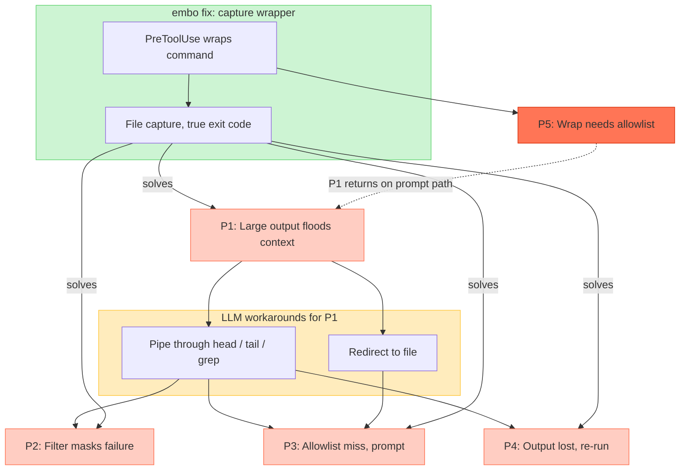

# Bash Output Capture — Problem Map

Status: analysis (2026-06-10). Source: live session where a
prompt-approved `sed ... | xargs kubectl delete` ran unwrapped and
flooded the context, despite the 029 capture wrapper being installed.

## The problems

### P1 — Large output floods the context (root problem)

A Bash command can produce hundreds or thousands of lines. The harness
inserts all of it into the model context. Tokens are wasted, earlier
conversation content gets compacted away, and the model loses working
memory.

### P2 — Filtering destroys the success signal

The model's natural workaround for P1 is `cmd | head` / `| grep` /
`| tail`. But the pipeline's exit code is the *filter's* exit code, not
the command's. A failing command piped into `head` reports 0. The model
concludes "success" from a failure.

### P3 — Filtering and redirecting break allowlist matching

`kubectl get pods` may be allowlisted, but `kubectl get pods | head -20`
or `kubectl get pods > out.log 2>&1` is a different command string — it
no longer matches the allow-rule. Result: a permission prompt for a
command that was supposed to be zero-prompt. The workaround for P1
destroys the autonomy the allowlist was built to provide.

### P4 — Filtered-away output is lost; recovery means re-running

If the model `grep`s for one thing and later needs another, the rest of
the output is gone. The only way to see it is to run the command again —
slow, and dangerous when the command is not idempotent (a re-run
`kubectl delete` acts on different state).

### P5 — The capture fix has a coverage gap

The embo solution (tasks 027–029) — a PreToolUse hook rewrites the
command through `embo-capture.sh`, which saves full output to a file
and returns a short marker with the true exit code — solves P1–P4
simultaneously. But a PreToolUse hook can only rewrite commands it
*approves*, i.e. allowlisted ones. A command approved through the
permission prompt runs unwrapped — P1 returns in full force.

Coverage is coupled to approval, although output size and approval are
independent concerns.

## How they connect

P1 is the root. P2–P4 are damage caused by the model's own workarounds
for P1. The capture wrapper resolves all four at once — but only inside
the allowlist boundary, which is P5.



## Verified solution for P5 (research, 2026-06-11)

Researched via NotebookLM against the official hooks docs and GitHub
issues. Notebook:
https://notebooklm.google.com/notebook/c5f0275c-e052-41d7-86da-410b5771720d

### Recommended: PreToolUse `updatedInput` + `permissionDecision: "ask"`

**Verification status (2026-06-11, second check): now documented.** An
earlier doc check found no explicit statement, but the current Hooks
Reference states: "Combine with 'allow' to auto-approve, or 'ask' to
show the modified input to the user. For 'defer', ignored." Also
documented: the modified input is re-evaluated against deny and ask
rules. A live spike remains prudent before shipping, but the contract
is official.

With it, `approve-compound.sh` can wrap every eligible Bash command:

- allowlisted → `allow` + wrapped command (current behavior, unchanged)
- not allowlisted → `ask` + wrapped command (new: prompt still fires,
  but the approved command is the wrapped one — capture works)

This decouples capture coverage from approval, resolving P5.

Risks and constraints:

- The permission dialog shows the wrapped `embo-capture.sh --b64 ...`
  string, not the clean original. `permissionDecisionReason` can carry
  the original command for readability.
- The modified input is re-evaluated against native deny/ask rules —
  the wrapper allow-rule (`Bash(~/.claude/hooks/embo-capture.sh *)`)
  must stay in place.
- Multiple PreToolUse hooks returning `updatedInput` race
  (last-write-wins); keep a single rewriting hook.
- With `permissionDecision: "defer"`, the whole hook decision including
  `updatedInput` is discarded — that path stays uncovered.
- The modified input is re-evaluated against deny and ask rules
  (documented), so the wrapper invocation itself must keep its
  allow-rule and must never match a deny rule.
- `updatedInput` enforces a field whitelist: for Bash only `command`
  is applied; other fields are silently dropped (GitHub #32105).
- No documented length limit on the `updatedInput` command string;
  very long base64 payloads are unverified — spike.

## Chosen direction: filter-triggered capture (2026-06-11)

Reframing (user): P1 is already self-managed — the model filters
(`| head`, `| grep`) when it expects bulk. The real damage is P4
(filter guessed wrong → re-run, unsafe when non-idempotent) and P2
(filter masks the upstream exit code). The trigger for capture is
therefore not "output is large" but "**the command contains a
filter**" — a filter is an explicit signal that more output exists
than is wanted inline. 100% coverage is explicitly NOT a goal:
commands that resist safe rewriting fall through unwrapped, by design.

### Mechanism: pipeline decomposition in embo-capture.sh

On the allow path (as today), `approve-compound.sh` detects
`<upstream> | <filter-chain>` where every trailing segment head is in
a FILTER_HEADS list (head tail grep sed awk cut wc sort uniq jq tr
column) and the upstream is wrap-eligible. It rewrites to:

```
embo-capture.sh --filter-b64 <b64 of filter chain> --b64 <b64 of upstream>
```

The wrapper runs the upstream alone (full stdout to the capture
file), records its exit code, pipes the captured stdout through the
filter chain for the inline view, and prints a marker carrying the
capture path plus BOTH exit codes (upstream and filter). The shipped
REDIRECT-CMD-OUTPUT rule gains one clause: if the filter missed what
you needed, Read/Grep the capture file — never re-run.

### NotebookLM review verdict (2026-06-11)

Nothing in the plan contradicts the docs. `allow` + `updatedInput` is
fully documented; Bash tool runs `bash -c -l` (login shell,
non-interactive, not a TTY); rewriting only the `command` field is the
supported shape.

Semantic differences between `a | b` and "a to file; b on file" that
the design must handle:

1. **SIGPIPE early-exit is lost.** In `a | head -5`, head's exit
   terminates `a`. Decomposed, `a` runs to completion — a streaming
   producer hangs, an expensive one burns time/disk. Exclusions must
   cover any producer relying on the filter to terminate it; the
   wrapper needs a timeout and a max-bytes cap.
2. **Two exit codes matter.** Upstream's code fixes P2, but the
   filter's code is also a signal (`grep` exit 1 = no match). The
   marker reports both; the tool-visible exit code is chosen
   deliberately (filter's, matching native pipe semantics).
3. **stderr routing.** In a real pipe only stdout passes through the
   filter. Capture stdout and stderr separately; feed only stdout to
   the filter chain.
4. **Sequential, not concurrent**: added latency and full-output disk
   cost are accepted trade-offs.

Exclusions (never rewrite): follow/streaming producers (`tail -f`,
`watch`, `journalctl -f`), early-exit-for-cost filters (`grep -q`,
`head -c` on expensive producers), side-effect filters (`sed -i`,
`tee`), `xargs` (executor, not filter), plus all existing should_wrap
opt-outs.

The `ask`+`updatedInput` extension (wrap non-allowlisted commands too)
is documented and can follow as a separate increment after the
filter-capture core ships.

### Rejected: PostToolUse `updatedToolOutput`

`updatedToolOutput` is documented (value must match Bash's output shape
`{stdout, stderr, interrupted, isImage}`), but GitHub issues #54196 and
#65403 (with repro) show Claude Code silently ignores it for Bash — the
original output still reaches the model. A claimed fix in v2.1.121
regressed. Additionally, Claude Code natively persists Bash output over
30,000 chars to disk **before** PostToolUse fires, so the hook only
ever sees the ~2,000-char preview. Do not build P5 coverage on this.

A PostToolUse hook remains useful only as an additive safety net: on
detecting the native truncation marker, return `additionalContext`
pointing the model at the natively persisted temp file (capped at
10,000 chars; cannot remove the preview).

### Follow-up seed: voluntary runner for the non-allowlisted path (2026-06-11)

Idea (user): close the residual P5 gap with an agent-facing runner
invoked by prompt rule instead of hook rewrite — `embo-run 'cmd'`
(thin CLI over `embo-capture.sh`, plain readable args, no base64).

What it adds over the hooks: when a command is NOT allowlisted, the
user's approval dialog approves the *runner* call itself, so even
prompt-approved commands get full capture + true exit codes — the one
path the PreToolUse hook can never reach (it only rewrites calls it
approves).

Two constraints from the discussion:

1. **Addition, not replacement.** Prompt adherence is probabilistic
   (rules fade over long sessions and after compaction — task 029
   exists because of this); the hook stays as the deterministic layer
   for allowlisted traffic. The runner targets only non-allowlisted,
   bulky-output commands.
2. **No approval widening.** A blanket `Bash(embo-run *)` allow-rule
   would auto-approve any embedded command (the RTK-rewriter
   criticism, GitHub #32105/#36843). The runner must source
   `decide()` from approve-compound.sh and refuse inner commands that
   match a deny rule; it gets no allow-rule of its own — every
   invocation prompts, but the approved invocation is captured.

Priority ranking (user, 2026-06-11): the non-negotiable goal is
"full output always on disk — never re-run a command purely to
re-obtain its output" (P4). The true exit code (P2) is a bonus taken
where it costs nothing; on the prompted path, losing it is an
acceptable trade — the status quo (plain filter pipe) masks it
anyway.

Given that ranking, two tool shapes stay candidates for the
non-allowlisted path:

- `embo-run 'cmd'` — executes the command, keeps both exit codes;
  must source `decide()` for deny rules; no allow-rule of its own
  (every call prompts; the approved call is captured).
- `cmd | embo-filter --grep X --head N` — pure stdin filter with
  built-in primitives only (no arbitrary command execution, so its
  own allow-rule widens nothing); saves full stdin to a capture
  file; loses the upstream exit code (accepted per ranking); still
  unusable after streaming producers (must consume all of stdin).

Rejected variant: `cmd | embo-filter <arbitrary command>` — arbitrary
filter execution would make its allow-rule an approval bypass
(awk system(), sed -i); restrict to built-in primitives or reject.

### Built-in behavior that bounds P1

Since ~v2.1.2 Claude Code natively saves Bash output over 30,000 chars
to a temp file and shows a ~2,000-char preview plus the file path. So
the unwrapped worst case for P1 is bounded at ~30k chars, not
unbounded. `BASH_MAX_OUTPUT_LENGTH` is documented to control the
threshold but is reportedly ignored (hardcoded 30k, issue #17944).
`MAX_MCP_OUTPUT_TOKENS` is MCP-only, irrelevant to Bash. Shell-level
wrapping (BASH_ENV etc.) was evaluated and rejected as brittle.
